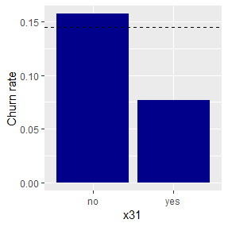
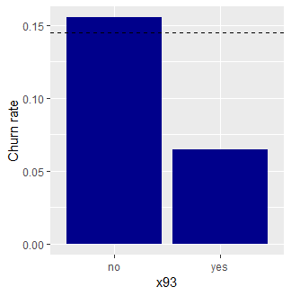
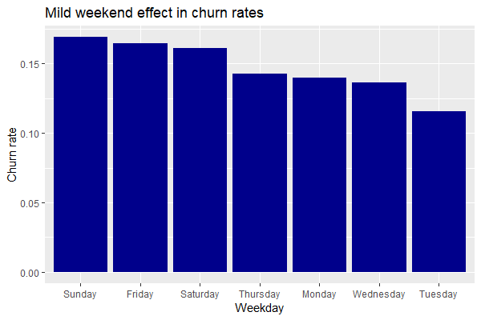

# Building up Insurance Customer Churn Prediction Models

## Introduction

A churn model, also known as a customer attrition model, is a predictive
model used by businesses to identify customers who are likely to
discontinue using the products or services. It helps businesses take
proactive measures to retain customers and mitigate the negative impact
of churn.

Here I demonstrate the steps for building up a churn prediction model
using a synthetic insurance customer dataset that mimic real-world dirty
data. The train data contains a binary target variable (0: staying, 1:
churn) and 100 de-identified features for 40K customers. After building
a binary classifier, I will generate churn predictions for 10K customers
in the test data.

As a modeling strategy, I will consider 5 candidate feature sets that
are chosen using logistic regression with LASSO penalty. For each
candidate feature sets, I will apply logistic regression, multilayer
perceptron, random forests, and decision tree models, searching for an
optimal model showing the best prediction performance in the validation
data in terms of AUC measures.

#### Build-up processes I have taken are listed below. 
#### Analysis codes can be found via the notebook links below.

## Step 1 - Clean and prepare data

- Notebook ([html](https://rpubs.com/JungsikNoh/InsuranceCustomerChurnPredictionModel_Part1), [pdf](/notebooks/buildingChurnPredictionModel_part1.pdf)  )

#### 1-2. Sanity check and basic data cleaning for train data
#### 1-3. Impute missing values of numerical features using k-nearest neighbor (knn) method

## Step 2 - Build up churn models

- Notebook ([html](https://rpubs.com/JungsikNoh/ChurnPredictionModel_Part2), [pdf](/notebooks/buildingChurnPredictionModel_part2.pdf)  )

#### 2-1. Preliminary logistic regression with all the features (model name: lr_full)
#### 2-2. Logistic regression after including squared continuous features (model name: lr_full2)
#### 2-3. Logistic regression with LASSO penalty for feature selection (model name: lr_LASSO)
#### 2-4. Extract candidate feature sets from the glm-LASSO fit
#### 2-5. Logistic regressions with the chosen 5 feature sets and their prediction performances (model names: lr_models)
#### 2-6. Random forests with the chosen 5 feature sets and their prediction performances (model names: rf_models)
#### 2-7. Decision trees with the chosen 5 feature sets and their prediction performances (model names: dt_models)
#### 2-8. Multi-layer Perceptron (MLP) with the chosen 5 feature sets and their prediction performances (model names: mlp1_models, mlp2_models)

## Step 3 - Generate churn predictions for test data

- Notebook ([html](https://rpubs.com/JungsikNoh/CustomerChurnPredictionModel_Part3), [pdf](/notebooks/buildingChurnPredictionModel_part3.pdf)  )

#### 3-1. Apply the same data cleaning done to train data for test data
#### 3-2. Impute missing values of numerical features using k-nearest neighbor (knn) method as in train data
#### 3-3. Include squared continuous features
#### 3-4. Predict test data using the optimal logistic regression (when k = 2) (chosen model: lr_models[[2]])
#### 3-5. Predict test data using the optimal Multi-layer perceptron (when k = 2) (chosen model: mlp1_models[[2]])

## Conclusion and Implications

- The project goal is to predict which customers are likely to cancel current insurance 
based on 100 features in a dataset with 40,000 customer records. I built two predictive models using R. One is a logistic regression model, and the other is a multilayer perceptron (or a neural network) model.

- Through simple exploratory data analysis (EDA), two interesting categorical variables were identified to be useful to tell which customers will be loyal. 
  - x31_yes group (~15% of total) has a very low churn rate (0.08).
  - x93_yes group (~11% of total) has a very low churn rate (0.07).

(Dash line denotes the overall churn rate.)
>   
 

- Through the EDA, a mild weekend effect were found.
  - Fri~Sun churn rates are higher (> 0.160) than overall average 0.145. 

> 

- Some of the prediction features were identified to have informative non-linear relations to the target variable. 
  - “x4_squared” “x18_squared” “x40_squared” “x87_squared”
  - Especially, ‘x4’ shows a clear non-linear effect. The higher ‘x4’ is the lower ‘y’ is.

> 

- An optimal model was searched for across logistic regression, multilayer perceptron, random forest, and decision tree models together with 5 candidate feature sets that are chosen by a method using logistic regression with LASSO penalty.

- The first selected model is a logistic regression model using 74 extended features, and the second selected model is a multilayer perceptron model using the same feature set. 

- Estimates of AUC for the test data are the validation AUC for each model, which is 80.93% for the logistic regression, and 79.78% for the multilayer perceptron.

- The logistic regression model is recommended because it has better interpretability and showed better prediction performances in a validation dataset.

#

